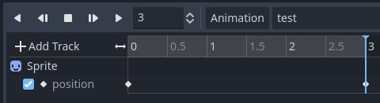

# Animation Player inconsistencies

First, we create a scene with an animation player and a sprite that will be moved through it. When the scene starts, the root node Test will play the animation created in the animation player and print the paths associated to each of its tracks. We will move through different arrangements of this same basic scene to see how it affects the path.

## First arrangement

In this case, we get `{ 0: ^"Sprite:position" }`, which is the path to the Sprite node in relation to the animation player's parent. This is consistent with Godot's official documentation.

## Second arrangement

Upon adding this new node, it is of note that the animation set up in the animation player no longer works. We must delete the sprite track and recreate it for it to work.

In this case, we get `{ 0: ^"Node/Sprite:position" }`, which is the path to the Sprite node in relation to the test node, which is not the animation player's parent, but the scene's root. This is not consistent with the documentation for AnimationPlayer.

## Third arrangement

Finally, we make Node the root of the scene tree and attach the test script to it. This once, we don't need to recreate the animation for it to work.

In this case, we once again get `{ 0: ^"Node/Sprite:position" }`, which is the path to the Sprite node in relation to the viewport. This is not consistent with the documentation for Animation Player.

Since the scene tree is basically the same as the first arrangement, I expected this would result in the same path, but this isn't the case.